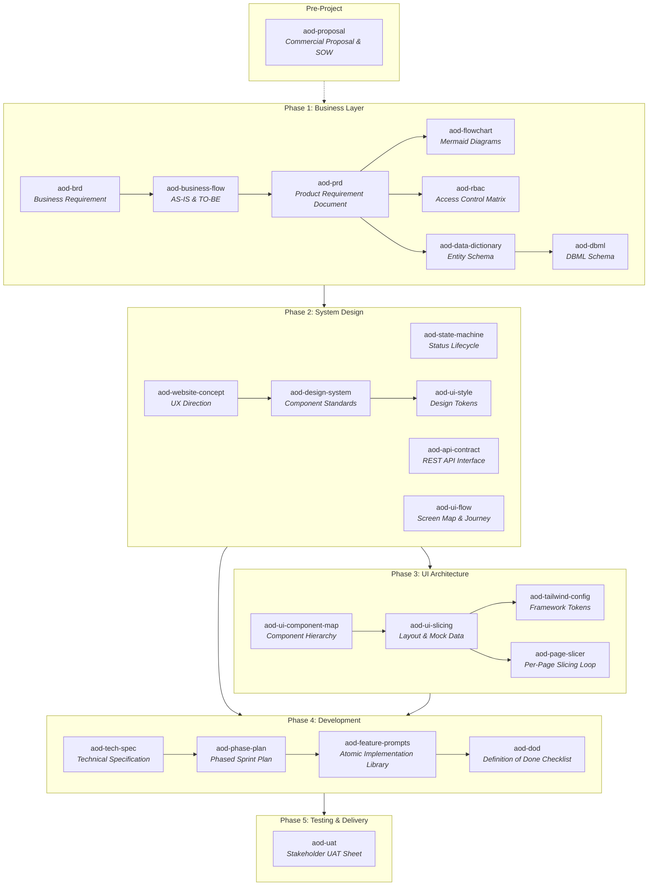

# AI-Orchestrated Development (AOD) Framework

[](#overview)
[](#-skills-inventory--phase-mapping)
[](#-how-to-use-in-real-projects)
[](LICENSE)

> **"AI executes. Architect decides. Structure governs."**
>
> Metodologi pengembangan perangkat lunak dan ekosistem *agentic skills* untuk mentransformasi AI dari autopilot tanpa kendali menjadi **implementation accelerator yang disiplin, terstruktur, dan patuh arsitektur**.

---

## 📑 Daftar Isi

- [Quick Install (One-Liner)](#-quick-install-one-liner)
- [Overview](#-overview)
- [Mengapa AOD Dibutuhkan?](#-mengapa-aod-dibutuhkan)
- [Prinsip Fundamental](#-5-prinsip-fundamental)
- [Alur Kerja (End-to-End Workflow)](#-alur-kerja-end-to-end-workflow)
- [Skills Inventory & Phase Mapping](#-skills-inventory--phase-mapping)
- [Guardrails & Rules Enforcement](#-guardrails--rules-enforcement)
- [Panduan Penggunaan di Real Project](#-panduan-penggunaan-di-real-project)
- [Struktur Output Dokumen](#-struktur-output-dokumen)
- [Skill Ekosistem Pelengkap](#-skill-ekosistem-pelengkap)
- [Author & Maintainer](#-author--maintainer)
- [Lisensi](#-lisensi)

---


## ⚡ Quick Install (One-Liner)

Pasang seluruh ekosistem AOD Framework (24+ Skills, 3 Rules, AGENTS.md, dan struktur scaffold `docs/`) ke dalam project apa pun (proyek baru maupun proyek yang sudah berjalan seperti Laravel, Next.js, Vue, Django, dsb.) dengan **satu baris perintah**:

```bash
curl -fsSL https://raw.githubusercontent.com/or-abdillh/AI-Orchestrated-Development-AOD/main/install.sh | bash
```

> **Atau tentukan direktori target secara spesifik:**
> ```bash
> curl -fsSL https://raw.githubusercontent.com/or-abdillh/AI-Orchestrated-Development-AOD/main/install.sh | bash -s -- /path/to/your/project
> ```

---

## 💡 Overview

**AI-Orchestrated Development (AOD)** adalah framework yang dirancang khusus untuk pengembang mandiri (*solo developers*), konsultan teknis, dan tim freelance yang membangun sistem skala SME (*Small-Medium Enterprise*).


Alih-alih membiarkan AI mengasumsikan arsitektur atau melompati fase rekayasa perangkat lunak, AOD menerapkan **rantai dependensi dokumen yang ketat**:

```
Business Discovery ➔ System Design ➔ UI Architecture ➔ Phased Development ➔ Quality & Testing
```

Setiap fase memiliki persona spesialis, dokumen input wajib, batasan ketat (*constraints*), dan artefak keluaran terstandarisasi.

---

## 🛑 Mengapa AOD Dibutuhkan?

| Masalah AI Autopilot Biasa | Solusi Terorkestrasi AOD |
|---|---|
| **Halusinasi & Skema Acak:** AI mengarang kolom database yang tidak pernah disepakati. | **Single Source of Truth:** Seluruh kolom dan tipe data dikunci pada `DATA_DICTIONARY.md`. |
| **Logic Bocor ke Controller:** AI menaruh query dan business logic sembarangan. | **Architectural Rules:** Dipaksa melalui Service Layer, FormRequest, dan Policy guards. |
| **Lompat Langsung Coding:** Menghasilkan kode tanpa fondasi domain yang jelas. | **Phase Discipline:** AI diblokir membuat kode sebelum PRD, Tech Spec, dan Phase Plan final. |
| **UI Generik ("AI-Slop"):** Tampilan terasa murah, inkonsisten, dan membosankan. | **Design Token Authority:** Mengunci styling lewat UI Style Document dan filter `antislop`. |
| **Ketiadaan Pengujian:** Kode dianggap selesai saat tidak ada error sintaks. | **Definition of Done & UAT:** 6 pilar verifikasi ketat sebelum kode dapat di-merge. |

---

## 🏛️ 5 Prinsip Fundamental

1. **Architecture First:** Arsitektur dan pemodelan data diputuskan sebelum satu baris kode implementasi ditulis.
2. **Phase-Driven Execution:** Eksekusi dilakukan berurutan berdasarkan dependensi logis dengan pendekatan *MVP-first*.
3. **Feature-Level Atomic Workflow:** Siklus disiplin: `1 Fitur ➔ 1 Prompt ➔ 1 Review ➔ 1 Validasi ➔ 1 Commit`.
4. **Definition of Done Enforcement:** Tidak ada fitur yang selesai tanpa lulus kepatuhan struktur, otorisasi, proteksi N+1, dan automated tests.
5. **AI as Controlled Executor:** AI bertindak sebagai akselerator implementasi, bukan pengambil keputusan arsitektur.

---

## 🔄 Alur Kerja (End-to-End Workflow)



---

## 🛠️ Skills Inventory & Phase Mapping

Repository ini dilengkapi dengan **24 native agent skills** yang tersimpan di [`.agents/skills/`](.agents/skills/):

### Entry Point & Pre-Project
| Skill | Command Trigger | Input Dokumen | Output Artefak |
|---|---|---|---|
| **`aod-orchestrator`** | `"start AOD"`, `"mulai AOD"`, `"panduan AOD"` | *None (Interactive)* | Panduan langkah per langkah |
| **`aod-proposal`** | `"buat proposal"`, `"project quotation"` | PRD, Tech Spec | `docs/proposal/PROPOSAL.md` |

### Phase 1 — Business Layer
| Skill | Persona | Input Wajib | Output Artefak |
|---|---|---|---|
| **`aod-brd`** | Enterprise Business Analyst | Study Case | `docs/business/BRD.md` |
| **`aod-business-flow`** | Business Process Architect | Study Case | `docs/business/BUSINESS_FLOW.md` |
| **`aod-prd`** | Senior Product Manager | BRD, Business Flow | `docs/business/PRD.md` |
| **`aod-flowchart`** | BPA & System Architect | Business Flow | `docs/business/FLOWCHART.md` |
| **`aod-rbac`** | Access Control Architect | PRD | `docs/business/RBAC.md` |
| **`aod-data-dictionary`**| Senior Data Architect | PRD | `docs/business/DATA_DICTIONARY.md` |
| **`aod-dbml`** | Database Designer | Data Dictionary | `docs/business/SCHEMA.dbml` |

### Phase 2 — System Design
| Skill | Persona | Input Wajib | Output Artefak |
|---|---|---|---|
| **`aod-state-machine`** | DDD Specialist | Business Flow (TO-BE), PRD | `docs/system-design/STATE_MACHINE.md` |
| **`aod-api-contract`** | Backend API Architect | PRD, Data Dictionary | `docs/system-design/API_CONTRACT.md` |
| **`aod-ui-flow`** | UX System Designer | PRD, Business Flow | `docs/system-design/UI_FLOW.md` |
| **`aod-website-concept`**| Product Strategist & UX Arch | Study Case, BRD, UI Flow | `docs/system-design/WEBSITE_CONCEPT.md` |
| **`aod-design-system`** | Design System Architect | Website Concept | `docs/system-design/DESIGN_SYSTEM.md` |
| **`aod-ui-style`** | Senior Product Designer | Website Concept, Design System | `docs/system-design/UI_STYLE.md` |

### Phase 3 — UI Architecture
| Skill | Persona | Input Wajib | Output Artefak |
|---|---|---|---|
| **`aod-ui-component-map`**| Frontend Architect | UI Flow, Design System | `docs/ui-architecture/COMPONENT_MAP.md` |
| **`aod-ui-slicing`** | UI Engineer | Component Map, Style Doc | `docs/ui-architecture/UI_SLICING.md` |
| **`aod-tailwind-config`**| CSS Architecture Specialist | UI Style Document | `tailwind.config.ts` / tokens |
| **`aod-page-slicer`** | Pixel-Perfect UI Engineer | UI Slicing, Component Map | Kode komponen per halaman |

### Phase 4 — Development
| Skill | Persona | Input Wajib | Output Artefak |
|---|---|---|---|
| **`aod-tech-spec`** | Solution Architect | PRD, Data Dict, RBAC, Flow | `docs/development/TECH_SPEC.md` |
| **`aod-phase-plan`** | Technical Project Manager | Technical Specification | `docs/development/PHASE_PLAN.md` |
| **`aod-feature-prompts`**| AI Development Strategist | Tech Spec, Phase Plan | `docs/development/FEATURE_PROMPTS.md` |
| **`aod-dod`** | Software Quality Auditor | Tech Spec, Feature Prompts | `docs/development/DOD.md` |

### Phase 5 — Testing
| Skill | Persona | Input Wajib | Output Artefak |
|---|---|---|---|
| **`aod-uat`** | QA Lead & Product Delivery | PRD, Flow, State Machine | `docs/testing/UAT_SHEET.md` |

---

## 🛡️ Guardrails & Rules Enforcement

Sistem AOD dilindungi oleh file aturan otomatis yang selalu aktif di [`.agents/rules/`](.agents/rules/):

1. **`aod-core.md` (Always Active):**
   - Mencegah AI melompati fase implementasi (*phase discipline*).
   - Mengharuskan AI meminta klarifikasi jika dokumen prasyarat belum ada.
   - Menegakkan hierarki prioritas dokumen saat terjadi konflik (`Tech Spec > PRD > Flow > BRD`).
2. **`aod-coding-standards.md` (Development Phase):**
   - **Framework-Agnostic:** Mendukung Laravel, NestJS, Django, Next.js, FastAPI, Go, dll.
   - Memastikan pemisahan logika (Service/Use-Case layer vs Controller tipis).
   - Memblokir N+1 queries dengan eager loading wajib.
   - Validasi ketat di request layer dan otorisasi terpusat pada policy guards.
3. **`aod-document-versioning.md` (Document Lifecycle & Semantic Tracking):**
   - **Header Wajib:** Setiap dokumen di `docs/` wajib diawali dengan metadata versi semantic (`vMAJOR.MINOR.PATCH`), tanggal `Last Updated`, status dokumen, dan tabel `Revision History`.
   - **Version Bumping Otomatis:** AI wajib menaikkan versi setiap kali dokumen diperbarui (Major/Minor/Patch).
   - **Audit Trail Terjamin:** Setiap perubahan terdokumentasi rapi seiring berjalannya proyek.
4. **Git Feature-Branching Enforcement (Phase 4 Development):**
   - **Dilarang Direct Commit ke Main:** Semua eksekusi kode fitur wajib berada di branch terpisah.
   - **Konvensi Branch:** `phase/<num>-<phase-slug>` untuk branch fase, dan `feat/<module>-<feature-slug>` untuk branch per-fitur.
   - **Alur Atomik:** `Checkout branch -> Koding tugas 1-8 -> Validasi DoD -> Atomic commit (smart-git-commit) -> Merge/PR`.
   - **Skill Terintegrasi:** Didukung oleh `git-flow-branch-creator`, `git-workflow-and-versioning`, dan `smart-git-commit`.
5. **Context7 MCP Source-Driven Grounding (Official Docs Verification):**
   - **No Hallucinated APIs:** AI dilarang mengarang sintaks atau konfigurasi library pihak ketiga.
   - **Verifikasi Wajib:** AI wajib memanggil **Context7 MCP** (`resolve-library-id` dan `query-docs`) untuk memastikan dokumentasi resmi yang paling kredibel dan versi terkini dari library/tools yang digunakan (misal: Tailwind CSS, Prisma, Next.js, Laravel, dsb.).


```markdown
<!-- Contoh Header Metadata pada Setiap Dokumen docs/ -->
# Product Requirement Document (PRD)

> **Version:** `v1.2.0`  
> **Last Updated:** `2026-09-14`  
> **Status:** `Approved`  
> **Author / Generator:** `aod-prd`

---

### Revision History
| Version | Date | Author | Description of Changes |
|---|---|---|---|
| `v1.0.0` | 2026-09-10 | aod-prd | Initial draft from BRD & Business Flow. |
| `v1.1.0` | 2026-09-12 | aod-prd | Added Payment Gateway integration requirements. |
| `v1.2.0` | 2026-09-14 | aod-prd | Added multi-currency support and localized tax calculations. |
```

---


## 🚀 Panduan Penggunaan di Real Project

### 1. Inisialisasi Proyek Baru
Panggil orchestrator untuk memeriksa kelengkapan awal dokumen proyek Anda:
```text
User: "Mulai proyek baru dengan AOD."
Agent: Mengaktifkan aod-orchestrator, menanyakan ketersediaan Study Case / Business Discovery.
```

### 2. Membangun Dokumen Bisnis (Phase 1)
Jalankan pembentukan BRD dan Business Flow:
```text
User: "Generate BRD dari study case ini: [paste ringkasan bisnis]"
Agent: Menjalankan aod-brd -> menghasilkan docs/business/BRD.md

User: "Lanjut buat Business Flow dan PRD."
Agent: Menjalankan aod-business-flow -> aod-prd.
```

### 3. Merancang Sistem & Data (Phase 1 & 2)
Generate kamus data dan kontrak antarmuka:
```text
User: "Buat data dictionary dan skema DBML."
Agent: Menjalankan aod-data-dictionary dan aod-dbml.

User: "Rancang API contract dan UI flow."
Agent: Menjalankan aod-api-contract dan aod-ui-flow secara terpadu.
```

### 4. Eksekusi Koding Terkendali (Phase 4)
Setelah `TECH_SPEC.md` dan `PHASE_PLAN.md` disetujui, gunakan prompt library atomik:
```text
User: "Generate feature prompts untuk Module Orders."
Agent: Menghasilkan prompt per-fitur di docs/development/FEATURE_PROMPTS.md.

User: "Implementasikan Feature 1: Create Order menggunakan prompt dari library."
Agent: Mengeksekusi kode per-fitur (Migration -> Model -> Request -> Service -> Controller -> Policy -> Tests).
```

### 5. Validasi & Commit
Periksa checklist Definition of Done dan jalankan atomic commit:
```text
User: "Periksa kepatuhan DoD untuk fitur Create Order."
Agent: Menjalankan checklist aod-dod.

User: "Jalankan smart-git-commit."
Agent: Membagi perubahan menjadi atomic Conventional Commits.
```

---

## 📂 Struktur Output Dokumen

Semua artefak yang dihasilkan selama siklus AOD tersimpan rapi dalam folder `docs/`:

```text
docs/
├── business/
│   ├── BRD.md
│   ├── BUSINESS_FLOW.md
│   ├── PRD.md
│   ├── FLOWCHART.md
│   ├── RBAC.md
│   ├── DATA_DICTIONARY.md
│   └── SCHEMA.dbml
├── system-design/
│   ├── STATE_MACHINE.md
│   ├── API_CONTRACT.md
│   ├── UI_FLOW.md
│   ├── WEBSITE_CONCEPT.md
│   ├── DESIGN_SYSTEM.md
│   └── UI_STYLE.md
├── ui-architecture/
│   ├── COMPONENT_MAP.md
│   ├── UI_SLICING.md
│   └── DESIGN_TOKENS.md
├── development/
│   ├── TECH_SPEC.md
│   ├── PHASE_PLAN.md
│   ├── FEATURE_PROMPTS.md
│   └── DOD.md
├── testing/
│   └── UAT_SHEET.md
└── proposal/
    └── PROPOSAL.md
```

---

## 🧩 Skill Ekosistem Pelengkap

Framework ini terintegrasi langsung dengan skill industri terverifikasi dari ekosistem agen:

- **`domain-modeling`** *(Matt Pocock)*: Menajamkan model domain, bounded context, dan relasi data.
- **`tailwind-design-system`** *(Wshobson)*: Pola implementasi sistem desain dan layout berbasis Tailwind v4/v3.
- **`tdd`** *(Matt Pocock)*: Alur implementasi kode *Test-Driven Development* (Red-Green-Refactor).
- **`code-review`** *(Matt Pocock)*: Audit kualitas kode multi-axis sebelum merge.
- **`playwright-best-practices`** *(Currents.dev)*: Penulisan automated E2E tests berbasis skenario UAT.
- **`git-flow-branch-creator`** *(GitHub Awesome Copilot)*: Manajemen pembuatan branch git flow standar (`feature/*`, `release/*`, `hotfix/*`).
- **`git-workflow-and-versioning`** *(Addy Osmani)*: Best practices pengelolaan alur git, branching, dan semantic tagging.
- **`smart-git-commit`**: Pemilah commit git atomik berbasis Conventional Commits.
- **`antislop`**: Filter pencegah copy dan komponen UI bergaya AI generik.


---

## 👤 Author & Maintainer

Dikembangkan dan diarsiteki oleh:

**Oka R. Abdillah**
- **GitHub:** [@or-abdillh](https://github.com/or-abdillh)
- **Email:** [hans.abdillh05@gmail.com](mailto:hans.abdillh05@gmail.com)
- **Repository:** [AI-Orchestrated-Development-AOD](https://github.com/or-abdillh/AI-Orchestrated-Development-AOD)

---

## 📄 Lisensi

Didistribusikan di bawah lisensi MIT. Silakan gunakan, modifikasi, dan adaptasi untuk kebutuhan proyek perangkat lunak Anda.

